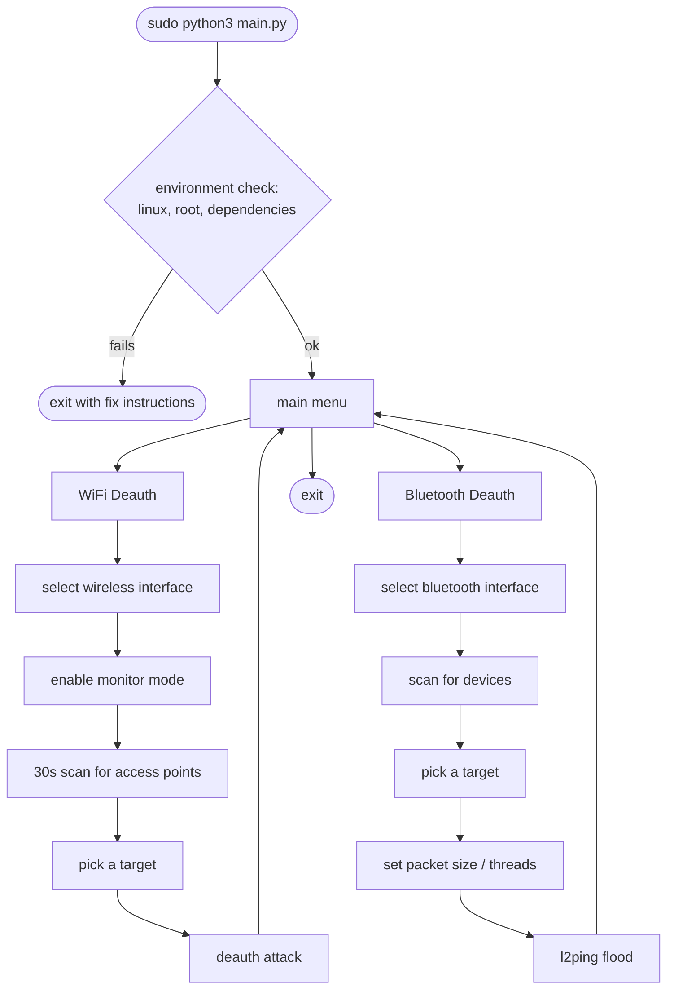

# AirFlood

A terminal WiFi and Bluetooth deauthentication toolkit for Linux, built for authorized security testing.


## What it does

Two modules, one menu:

- **WiFi Deauth** — puts an adapter into monitor mode, scans for nearby access points for 30 seconds, then sends deauth frames at whichever one you pick, via `aireplay-ng`.
- **Bluetooth Deauth** — scans for nearby Bluetooth devices and floods a chosen target with `l2ping`.



## Before you use this

Only point AirFlood at networks and devices you own, or have explicit written permission to test — a pentest scope, a CTF, your own lab. Deauthing someone else's WiFi or Bluetooth without permission is illegal in most places and you're on your own if you do it.

## Where this is at

I'm building and testing this one real run at a time on an actual Kali box, and it's not finished. Bugs get found and fixed as they come up — bad `airmon-ng` arguments, CSV parsing that choked on real `airodump-ng` output, terminal-width wrapping, that kind of thing. If something breaks on your end, that's the expected state right now, not something you did wrong — tell me what happened (module, step, what you expected vs. what you got, a screenshot if you can grab one) and it gets fixed.

Don't rely on this for a real engagement yet.

| Platform | Status |
|---|---|
| Kali Linux | actively tested — this is where fixes get verified |
| Parrot OS | same Debian base and tooling, should work, not actually tried yet |
| Other Debian-based (Ubuntu, Debian) | probably fine, untested |
| Fedora / Arch / non-Debian Linux | works once `aircrack-ng` and `bluez` are installed by hand — the built-in installer only knows `apt` |
| Windows / macOS | no — monitor mode and raw Bluetooth sockets don't work the same way |

## Requirements

- Linux, run as root
- Python 3
- A wireless adapter that supports **both** monitor mode and packet injection. A lot of built-in laptop chips do the first and not the second — check with `aireplay-ng --test <interface>` before you count on one. An external USB adapter with a known-compatible chipset (Atheros, Ralink) is the safer bet.
- A Bluetooth adapter
- [`aircrack-ng`](https://www.aircrack-ng.org/) (`airmon-ng`, `airodump-ng`, `aireplay-ng`) and `bluez` (`hciconfig`, `hcitool`, `l2ping`) — AirFlood checks for both on startup and offers to install whatever's missing via `apt`.

## Running it

```bash
git clone https://github.com/CodinWaffle/AirFlood.git
cd AirFlood
sudo python3 main.py
```

It has to run as root — monitor mode, interface control, and raw sockets all need it, and AirFlood checks for that up front instead of failing halfway through a scan later.

Each module also runs standalone if you just want to poke at one:

```bash
sudo python3 modules/wifi_deauth.py
sudo python3 modules/bluetooth_deauth.py
```

`Back` / `Exit` from anywhere returns you to the main menu rather than killing the process. `Ctrl+C` aborts whatever step is running.

## Project layout

```
AirFlood/
├── main.py                  # entry point: environment check, then main menu
├── modules/
│   ├── wifi_deauth.py       # interface -> monitor mode -> scan -> deauth
│   └── bluetooth_deauth.py  # interface -> scan -> l2ping flood
└── utils/
    ├── banner.py             # theme: colors, boxes, banners, animations
    └── dependencies.py       # platform / root / dependency checks
```

## Author

Jose Martin Imperial
[github.com/CodinWaffle](https://github.com/CodinWaffle) · [LinkedIn](https://www.linkedin.com/in/jose-martin-r-imperial-53a2b429a/)

---

Found a bug? The module, the step, what you expected vs. what happened, and a screenshot if you have one — that's what actually gets it fixed.
